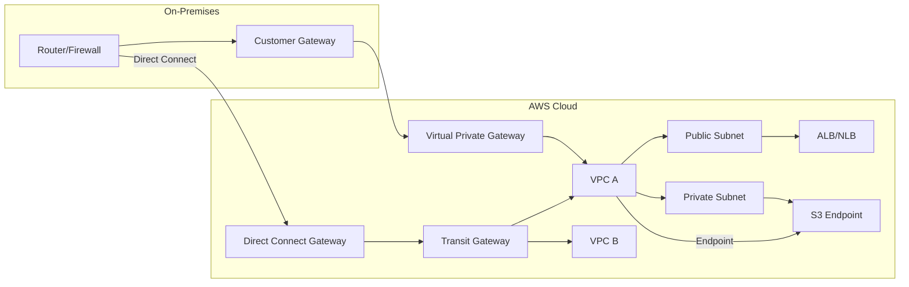
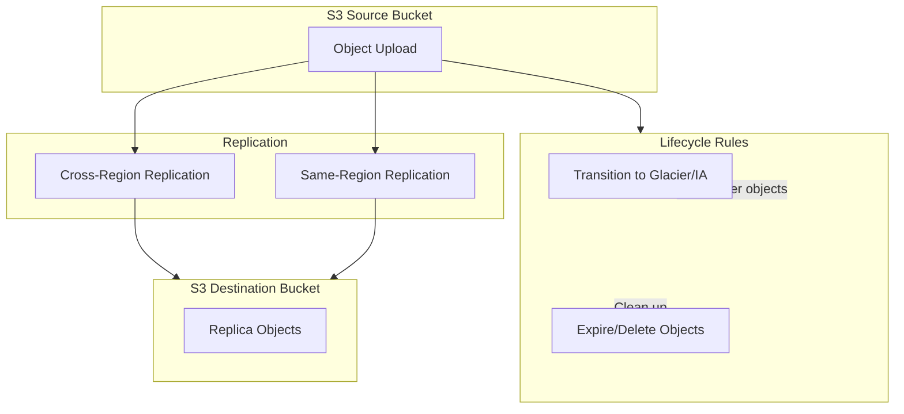
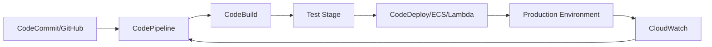
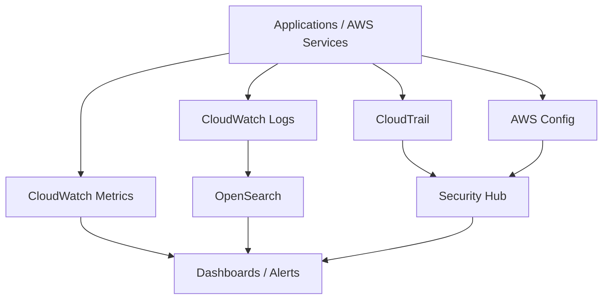
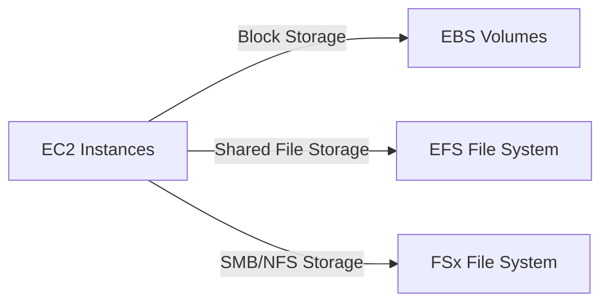

# AWS Architecture Diagrams

This file contains architectural diagrams for common AWS DevOps patterns. The diagrams are written in Mermaid syntax so they can be viewed in VS Code or rendered in tools that support Mermaid.

## 1. VPC and Hybrid Connectivity Architecture

### Notes
- `Customer Gateway` represents the on-premises router or VPN appliance.
- `Virtual Private Gateway` is the AWS-side endpoint for Site-to-Site VPN.
- `Direct Connect Gateway` connects Direct Connect links to multiple VPCs.
- `Transit Gateway` provides hub-and-spoke routing between VPCs and on-premises networks.
- `S3 Endpoint` is a private gateway endpoint to access S3 without the internet.

## 2. S3 Lifecycle and Replication Architecture

### Notes
- Lifecycle rules transition cold data to lower-cost storage classes and expire objects automatically.
- Replication can be configured for cross-region disaster recovery or same-region compliance.
- Versioning must be enabled on source and destination buckets for replication.

## 3. CI/CD Pipeline Architecture

### Notes
- Source code is stored in CodeCommit or GitHub.
- CodePipeline orchestrates build, test, and deployment stages.
- CloudWatch monitors deployments and can trigger rollback or notifications.

## 4. Observability and Governance Architecture

### Notes
- CloudWatch collects metrics and logs for monitoring.
- CloudTrail records API activity for auditing.
- AWS Config evaluates resource compliance and drift.
- OpenSearch indexes logs and provides dashboards.
- Security Hub aggregates findings from GuardDuty, Config, and other tools.

## 5. Storage Architecture for EC2, EFS, and FSx

### Notes
- Use EBS for block storage on individual instances.
- Use EFS for shared file storage across Linux instances.
- Use FSx for specialized file workloads such as Windows SMB or Lustre HPC.
